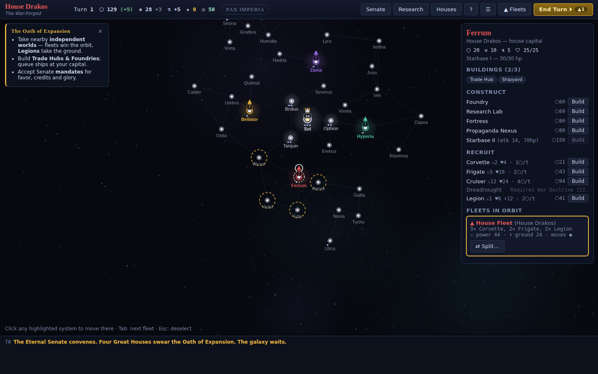
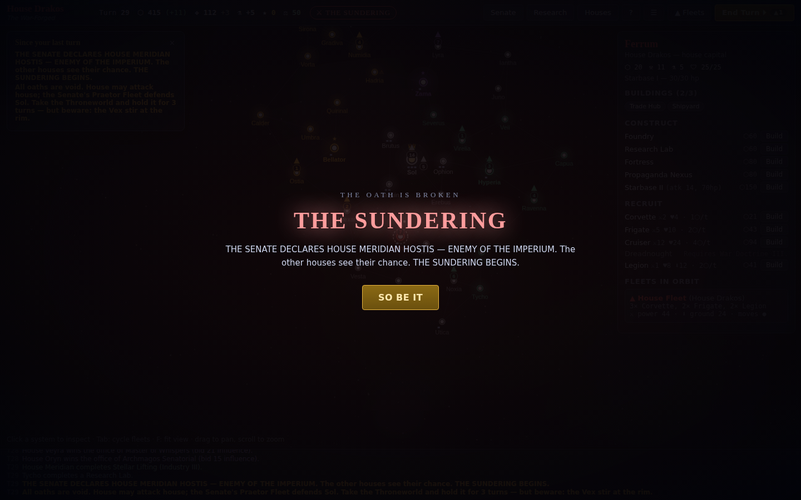
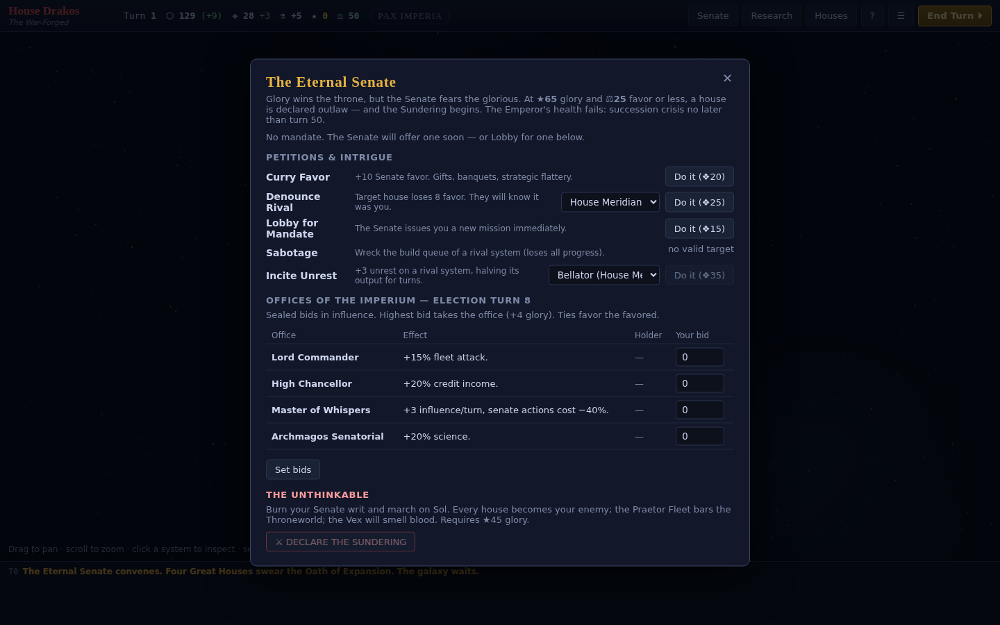

# 👑 Imperator Maximus

*Serve the Senate. Conquer the stars. Then march on the Throneworld.*

**▶ [PLAY IN YOUR BROWSER](https://raw.githack.com/AlexBBIO/Imperator-Maximus/claude/keen-mendel-7d3llw/index.html)** — no install. (For a permanent URL, enable GitHub Pages: repo **Settings → Pages → Deploy from a branch → `claude/keen-mendel-7d3llw` / root**, then play at `https://alexbbio.github.io/Imperator-Maximus/`.)

A browser-based space 4X for 1–4 players (hotseat + AI), built around the
best mechanic in **Rome: Total War** — being allies *and* rivals with the
other great houses of an empire, racing to conquer the frontier in the
Senate's name while everyone quietly arms for the inevitable civil war.



## How it ends (and why that's the point)

- Four **Great Houses** expand the Terran Imperium outward — taking
  independent worlds, fulfilling Senate mandates, rigging elections, and
  sabotaging each other through deniable intrigue. Houses **cannot** attack
  each other... yet.
- Conquest brings **★Glory**. Glory wins the throne — but the Senate fears
  the glorious, and your **⚖Favor** decays as your fame grows. Hit ★65 glory
  with ⚖25 favor and you are declared **outlaw**. Or declare the war yourself
  at ★45, on your own terms. If nobody moves, the Emperor dies by turn 50
  and the **Sundering** comes anyway.
- After the Sundering: all oaths void. Take **Sol** — defended by the
  Senate's Praetor Fleet — and hold it for 3 turns to be crowned, or be the
  last house standing.
- But the moment the Imperium bleeds, the **Vex Swarm** erupts at the rim and
  grows for as long as the civil war drags on. If the Vex take Sol or 45% of
  the galaxy, **every house loses**. Fight each other — just don't fight too
  long.

## Play

No install, no build, no dependencies:

```bash
# any static file server works:
npx http-server .        # or: python3 -m http.server
# then open http://localhost:8080
```

(Opening `index.html` directly from disk also works in most browsers.)

Set each house to Human or AI on the setup screen — 1 human vs 3 AI is the
classic experience; 2–4 humans is hotseat with a pass-the-device screen.
Saves go to localStorage automatically; export/import JSON saves from the ☰
menu (sending the file to a friend after your turn = play-by-mail).

**In-game `?` button has the full how-to-play.** Short version: click a
system to build (credits up front, production = speed), select your fleet ▲
and click any highlighted system to send it there (battles halt the march),
clear the orbit + drop **Legions** to take worlds, and visit the **Senate**
screen often — mandates, favor, elections, and dirty tricks are half the
game. `Tab` cycles fleets with moves left; `Enter` ends the turn; `F` fits
the map.





## Development

The engine is pure, deterministic, JSON-serializable state — completely
separated from the canvas/DOM view, so the whole game runs headless:

```bash
node tests/sim.js            # 12 AI-vs-AI games + invariants + determinism
node tests/sim.js --seed 7   # watch one full game's event log
node tests/debug.js 7 30 60  # per-turn military/economy probe of a seed
```

See [DESIGN.md](DESIGN.md) for the full design document — mechanics, balance
methodology, architecture, and the road to online multiplayer.

## Status

Playable prototype: full game loop (expansion → senate politics → civil war →
coronation/collective doom), 4 AI personas, hotseat multiplayer, saves,
battle reports, procedural galaxies. Tuning and feature backlog tracked in
[DESIGN.md §12](DESIGN.md).
